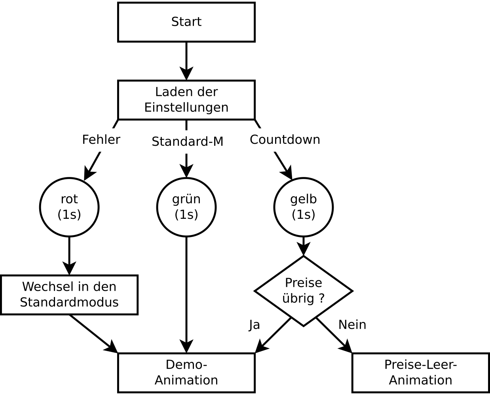
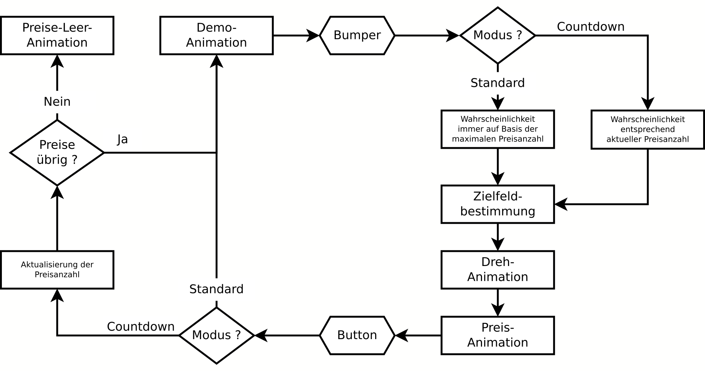
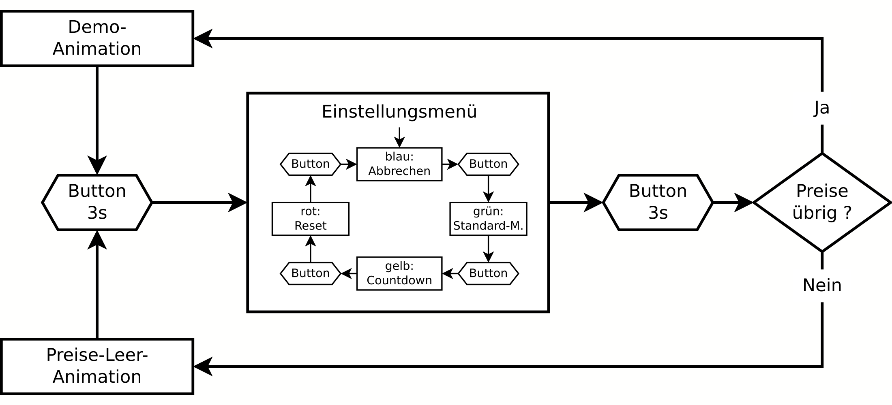

% Glücksrad
% RoboAG des JKG (PW)
% 08.10.2021

---
toc: true
---

## Hardware
Die gesamte Steuerung des Glücksrades erfolgt über zwei Knöpfe:

- Bumper     : extern am Glücksrad anzuschließender goldener Riesenknopf
- Mode-Button: kleiner, roter Knopf auf der Rückseite des Glücksrades

## Start
Beim Einschalten des Glücksrades wird automatisch der letzte Modus und die gespeicherte (Rest-)Preisliste geladen.
Anschließend wird der geladene Modus durch 1-sekündiges Aufleuchten aller LEDs dargestellt.

 \hspace{3cm} { height=10cm }

## Drehen & Modi
Befindet sich das Glücksrad in der Demo-Animation kann durch Drücken auf den Bumper die Drehanimation ausgelöst werden.
Sobald das Glücksrad auf einem zufälligen Feld zur Ruhe gekommen ist, startet die Preis-Animationen für die entsprechende Farbe.
Nur durch Betätigen des Mode-Button kann das Glücksrad zurück in die Demo-Animation wechseln.

 { width=16cm }

## Preise
Es gibt insgesamt fünf verschiedene Preiskategorien mit unterschiedlicher Wertigkeit.
Die Wahrscheinlichkeiten einen Preis zu erhalten ist nur abhängig von der Anzahl der hinterlegten bzw. verbleibenden Preise.

Beim Keplertag 2021 sind nur vier der fünf möglichen Preiskategorien belegt.

| Preis          | Anzahl der LEDs | Keplertag 2021 |
| -------------- | --------------- | -------------- |
| rubin   (rot)  |  2 von 20 (10%) |    36          |
| saphir  (blau) |  4 von 20 (20%) |    75          |
| silber  (weiß) |  7 von 20 (35%) |   150          |
| gold    (gelb) |  7 von 20 (35%) |   150          |

\newpage

## Einstellungsmenü

Das Glücksrad hat ein (verstecktes) Einstellungsmenü.
Es kann nur durch 3-sekündiges Drücken des Mode-Button in der Demo- oder der Preise-Leer-Animation erreicht werden.

Der ausgewählte Menüpunkt kann durch eine kurze Betätigung des Mode-Buttons gewechselt werden:

| Menü | Bedeutung                           |
| ---- | ----------------------------------- |
| blau | Einstellungsmenü abbrechen          |
| grün | Wechsel in den Standardmodus        |
| gelb | Wechsel in den Countdown-Modus      |
| rot  | Reset der internen Preisliste & Wechsel in den Countdown-Modus |

Durch ein 3-sekündiges Drücken des Mode-Button wird der aktuelle Menüpunkt ausgelöst.
Danach verlässt das Glücksrad das Einstellungsmenü automatisch.

 { width=16cm }

