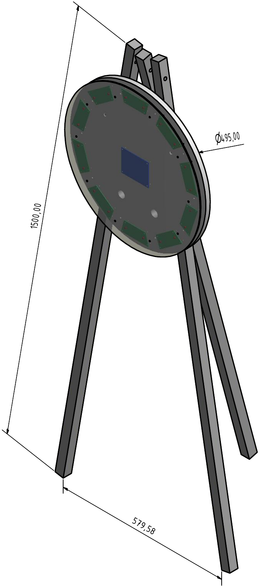

# project_gluecksrad
Bau eines elektrischen Glücksrades für schulische Veranstaltungen

Hier gibt es eine kleines [Demo-Video](https://www.youtube.com/watch?v=hORIZUaodIo&list=PL4P27g8g4QtTZY6d-4PRqTHP1PGKIp_SS) und eine [Bedienungsanleitung](Software/Fruehlingsmarkt_2018/README.md).

